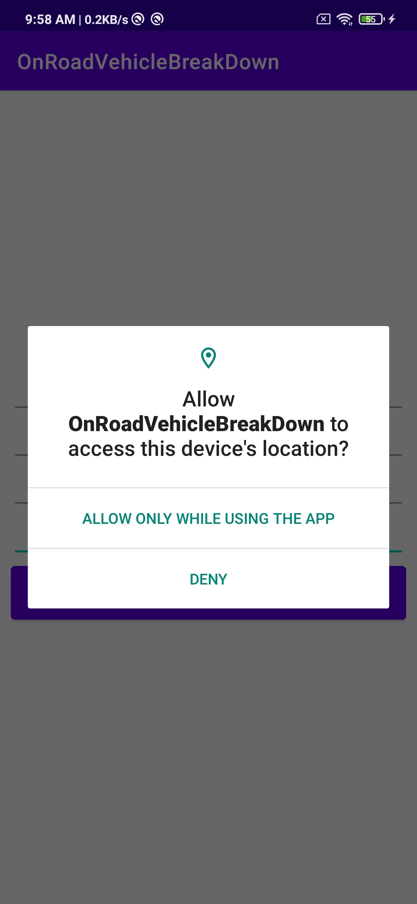
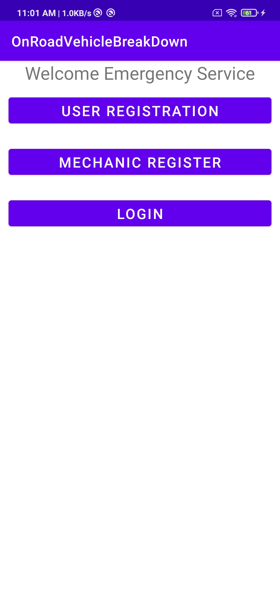

# OnRoadvechiclebreakdown_androidapp

***
#### _{ On Road Vehicle Breakdown Assistance (ORVBA) is going to be a good solution for the people who seek help in the remote locations with mechanical issues of their vehicle. Users of the On Road Vehicle Breakdown Assistance will be the registered public and they will be getting connected with the particular mechanic through the trustworthy On Road Vehicle Breakdown Assistance (ORVBA) system. }_

## Tools/Technologies Used
* Java - Java language was designed to be small, simple and portable across platforms, operating systems, both at the source and at the binary level
* Framework - Android - a software toolkit that enables app developers to piece together a finished product
* IDE - Android Stdio - Android Studio provides more features that enhance our productivity while building Android apps

## Deployement Technologies 
* Database: Google Firebase

## Description
_{ Users of On Road Vehicle Breakdown Assistance (ORVBA) system can search for list of mechanic at any location or the nearby locations which will help them in an unexpected situations raised by the mechanical issues of their vehicles. Only the licensed mechanics can get listed here while the search. Road assistance for car and there are available mechanic who can come and repair the mechanical issues in the users vehicle and also provides information about the nearby petrol bunks. }_

## Setup Requirements
* To run the android application, click the run icon on the toolbar or simply press Shift + F10 after importing the file that is file -> new -> import project

## Screenshots
![Screenshot of app asking device's location access]
![Screenshot of main page]

## Permissions
On Android versions prior to Android 6.0, App requires the following permissions:
* allow app to access device location

## Learn
If you want to learn how to develop an Android app, these courses are recommended
1) Android & Java Beginner: Mobile App Development: Go from beginner to paid professional app developer.(http://bit.ly/2ynlxYB) 
2) Kotlin for Android: Beginner to Advanced.(http://bit.ly/2k2cFU2)
